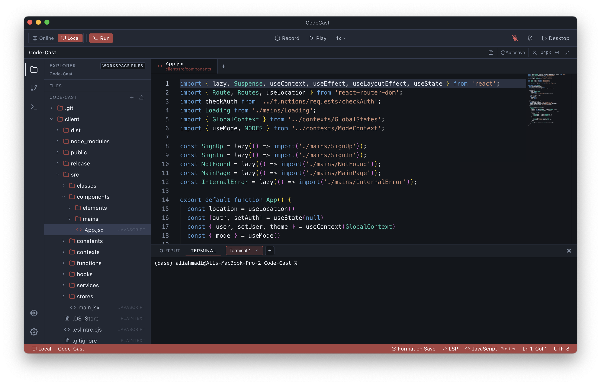

# Code Cast



Record and replay code typing sessions with synchronized audio. Capture keystrokes in a Monaco editor along with voice narration, then play back the entire session as a seamless video-like experience. Runs as a web app (online) or a desktop app via Electron (local).

## Features

- **Keystroke recording** — captures every character insertion/deletion with precise timing
- **Multi-file recording** — tracks file creation, switching, and editing across an entire project
- **Audio narration** — optional microphone recording synced with typing
- **Full playback** — replay with seekable progress bar, speed control (0.5x–4x), skip buttons
- **Code execution** — run JavaScript, TypeScript, and Python code inline
- **Integrated terminal** — full xterm.js terminal (local shell via Electron PTY, or WebSocket with sandboxed resources online)
- **File explorer & tabs** — tree view sidebar and tabbed multi-file editing
- **Project management** — create, open, rename, delete projects; open arbitrary folders (local mode)
- **Project templates** — HTML/CSS/JS, React, Python, Node.js starters
- **Export/Import** — save recordings as `.cvid` files for sharing or backup
- **Git integration** — stage, commit, push, and publish repos to GitHub (local mode)
- **Explain panel** — AI-powered code explanation (online mode)
- **Two modes**:
  - **Online** — server-backed with PostgreSQL, JWT auth, cloud storage
  - **Local** — fully offline via Electron with filesystem persistence (or IndexedDB in browser)
- **Keyboard shortcuts** — `Ctrl+Enter` (run), `Ctrl+R` (record), `Ctrl+P` (play), `Ctrl+O` (open), `` Ctrl+` `` (terminal), `?` (help)

## Setup

### Prerequisites

- Node.js 18+
- PostgreSQL (only required for online mode)
- [GitHub CLI](https://cli.github.com/) (optional, for publishing repos)

### Server (online mode)

```bash
cd server
cp .env.example .env   # configure DB credentials
npm install
npm start               # runs on http://localhost:4000
```

### Client (web)

```bash
cd client
npm install
npm run dev             # runs on http://localhost:5173
```

### Client + Electron (desktop app)

```bash
cd client
npm install
npm run electron:dev    # starts Vite + Electron concurrently
```

To build a distributable:

```bash
npm run electron:build  # produces DMG (macOS), NSIS (Windows), AppImage (Linux)
```

## Usage

1. Open the app at http://localhost:5173 (or launch the Electron app)
2. Sign up / sign in, or click **Continue Offline** to use local mode
3. Open or create a project using the folder icon in the sidebar
4. Write code in the editor — files appear in the explorer and tabs
5. Click **Record** (or `Ctrl+R`) to start capturing keystrokes and audio
6. Click **Stop** when done — the recording is saved
7. Click **Open** (or `Ctrl+O`) to browse recordings, then select one and press **Play** (or `Ctrl+P`)
8. Use **Export** to download a `.cvid` file, **Import** to load one
9. Toggle the terminal with `` Ctrl+` `` to run shell commands

## Project Structure

```
code-cast/
├── client/                    # React + Vite frontend
│   ├── electron/              # Electron main process (main.js, preload.cjs)
│   ├── public/                # Static assets (icons, styles)
│   ├── src/
│   │   ├── components/
│   │   │   ├── elements/      # UI components (Editor, Terminal, GitPanel, etc.)
│   │   │   └── mains/         # Page-level components (MainPage, SignIn, etc.)
│   │   ├── contexts/          # React contexts (GlobalStates, ModeContext)
│   │   ├── functions/         # Core logic (record, playback, file operations)
│   │   ├── services/          # API calls, formatters
│   │   └── stores/            # Persistence (IndexedDB, local filesystem)
│   ├── index.html
│   ├── package.json
│   └── vite.config.js
├── server/                    # Express + PostgreSQL backend
│   ├── config/                # Database configuration
│   ├── functions/             # Server utilities
│   ├── middlewares/           # Auth middleware (JWT)
│   ├── models/                # Sequelize models
│   ├── routes/                # API routes (user, project, etc.)
│   ├── server.js              # Express entry point
│   ├── terminal.js            # WebSocket terminal handler
│   └── .env.example           # Environment variable template
├── Screenshot.png
└── README.md
```

## File Format (`.cvid`)

```json
{
  "version": 3,
  "name": "My Recording",
  "files": {
    "index.js": {
      "language": "javascript",
      "firstValue": "console.log('hello');",
      "changes": [[{ "millis": 0, "type": 1, "index": 0, "value": "..." }]],
      "breakPoints": ["..."]
    }
  },
  "fileTimeline": [{ "millis": 0, "name": "index.js" }],
  "pauseResumePoints": [],
  "audio": "data:audio/webm;codecs=opus;base64,...",
  "duration": 12345
}
```

## Keyboard Shortcuts

| Shortcut       | Action               |
|----------------|----------------------|
| `Ctrl+Enter`   | Execute code         |
| `Ctrl+R`       | Start / Stop record  |
| `Ctrl+P`       | Play / Stop playback |
| `Ctrl+O`       | Open projects / recordings |
| `` Ctrl+` ``   | Toggle terminal      |
| `←` / `→`      | Skip back / forward 5s |
| `?`            | Toggle shortcuts help |

## Environment Variables

### Server (`server/.env`)

| Variable       | Description                | Default                    |
|----------------|----------------------------|----------------------------|
| `DB_HOST`      | PostgreSQL host            | `localhost`                |
| `DB_PORT`      | PostgreSQL port            | `5432`                     |
| `DB_NAME`      | Database name              | `codecast`                 |
| `DB_USER`      | Database user              | `codecast`                 |
| `DB_PASSWORD`  | Database password          | `codecast_pass`            |
| `BASE_URL`     | Server base URL            | `http://localhost:4000`    |
| `JWT_SECRET`   | JWT signing secret         | _(change to random value)_ |

## API Overview

| Method | Endpoint              | Description              |
|--------|-----------------------|--------------------------|
| POST   | `/user/signup`        | Create an account        |
| POST   | `/user/signin`        | Log in                   |
| GET    | `/user/signout`       | Log out                  |
| GET    | `/user`               | Get current user         |
| GET    | `/index/projects`     | List user's projects     |
| POST   | `/index/projects`     | Create a project         |
| GET    | `/index/projects/:id` | Get project details      |
| DELETE | `/index/projects/:id` | Delete a project         |

## Tech Stack

- **Client:** React 18, Monaco Editor, xterm.js, Dexie.js, Vite 4
- **Desktop:** Electron 42, electron-builder, node-pty
- **Server:** Express, Sequelize ORM, PostgreSQL, ws (WebSockets)
- **Auth:** JWT (cookie-based), bcryptjs
- **Dev tools:** ESLint, concurrently, nodemon

## License

ISC
