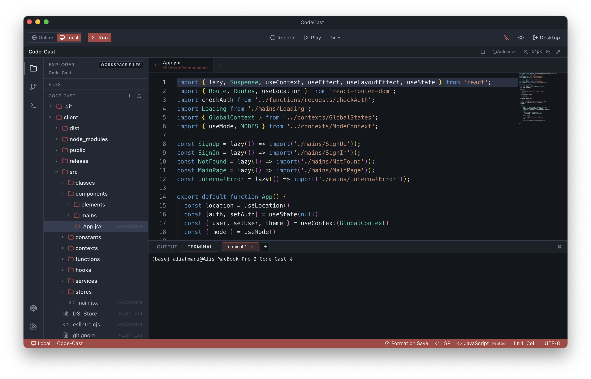

# Code Cast



Record and replay code typing sessions with synchronized audio. Capture keystrokes in a Monaco editor along with voice narration, then play back the entire session as a seamless video-like experience. Runs as a web app (online) or a desktop app via Electron (local).

## Features

- **Keystroke recording** — captures every character insertion/deletion with precise timing
- **Multi-file recording** — tracks file creation, switching, and editing across an entire project
- **Audio narration** — optional microphone recording synced with typing
- **Full playback** — replay with seekable progress bar, speed control (0.5x–4x), skip buttons
- **Code execution** — run JavaScript, TypeScript, and Python code inline
- **Integrated terminal** — full xterm.js terminal (local shell via Electron PTY, or WebSocket with sandboxed resources online)
- **File explorer & tabs** — tree view sidebar and tabbed multi-file editing
- **Project management** — create, open, rename, delete projects; open arbitrary folders (local mode)
- **Project templates** — HTML/CSS/JS, React, Python, Node.js starters
- **Export/Import** — save recordings as `.cvid` files for sharing or backup
- **Git integration** — stage, commit, push, and publish repos to GitHub (local mode)
- **Bring your own model** — every AI feature runs on **Ollama**, **LM Studio**, or any **OpenAI-compatible** server (llama.cpp, Jan, vLLM, LocalAI, text-generation-webui, OpenAI, OpenRouter, Groq), chosen per feature — see [AI Providers](#ai-providers)
- **AI inline completion** — ghost-text suggestions with FIM prompting tuned per model family (Qwen-Coder, DeepSeek-Coder, StarCoder, CodeGemma, Codestral, CodeLlama), and a chat-prompt fallback for any other model
- **AI inline edit** — `Ctrl+K` rewrites the selection from a plain-language instruction and shows a diff before applying it
- **AI chat** — streaming assistant with quick actions (explain, improve, find bugs, write tests) that can insert code back into the editor
- **Command palette** — `Ctrl+Shift+P` for fuzzy-searchable commands, `@` to jump to an open file
- **Explain panel** — streaming AI explanation of the code at the playback position
- **AI commit messages & terminal assistant** — commit messages from the staged diff; natural language → shell command
- **Configurable server endpoint** — point the app at any Code Cast server from the sign-in screen or **Settings → Server**, with a connection test that distinguishes "unreachable", "not a Code Cast server" and "reachable but its database is down"
- **Two modes**:
  - **Online** — server-backed with PostgreSQL, JWT auth, cloud storage
  - **Local** — fully offline via Electron with filesystem persistence (or IndexedDB in browser)
- **Keyboard shortcuts** — `Ctrl+Enter` (run), `Ctrl+R` (record), `Ctrl+P` (play), `Ctrl+O` (open), `` Ctrl+` `` (terminal), `?` (help)

## Setup

### Prerequisites

- Node.js 18+
- PostgreSQL (only required for online mode)
- [GitHub CLI](https://cli.github.com/) (optional, for publishing repos)

### Server (online mode)

```bash
cd server
cp .env.example .env   # configure DB credentials
npm install
npm start               # runs on http://localhost:4000
```

### Client (web)

```bash
cd client
npm install
npm run dev             # runs on http://localhost:5173
```

### Client + Electron (desktop app)

```bash
cd client
npm install
npm run electron:dev    # starts Vite + Electron concurrently
```

To build a distributable:

```bash
npm run electron:build  # produces DMG (macOS), NSIS (Windows), AppImage (Linux)
```

## Usage

1. Open the app at http://localhost:5173 (or launch the Electron app)
2. Sign up / sign in, or click **Continue Offline** to use local mode
3. Open or create a project using the folder icon in the sidebar
4. Write code in the editor — files appear in the explorer and tabs
5. Click **Record** (or `Ctrl+R`) to start capturing keystrokes and audio
6. Click **Stop** when done — the recording is saved
7. Click **Open** (or `Ctrl+O`) to browse recordings, then select one and press **Play** (or `Ctrl+P`)
8. Use **Export** to download a `.cvid` file, **Import** to load one
9. Toggle the terminal with `` Ctrl+` `` to run shell commands

## AI Providers

All AI features (autocomplete, chat, inline edit, explain, commit messages,
terminal) are configured in **Settings → AI Providers**, then each feature's
tab picks a provider and a model. Model fields list what the provider actually
has installed and warn when the chosen model is missing.

| Provider | Default URL | Setup |
| --- | --- | --- |
| Ollama | `http://localhost:11434` | `ollama pull qwen2.5-coder:1.5b` (autocomplete) and `ollama pull qwen2.5-coder:7b` (chat/edit) |
| LM Studio | `http://localhost:1234/v1` | Download a model, then **Developer → Start server**. Enable *Just-in-Time model loading* to switch models from Code Cast |
| OpenAI-compatible | — | Presets for llama.cpp, Jan, vLLM, LocalAI, text-generation-webui, OpenAI, OpenRouter, Groq. Optional API key |

**Settings → AI Models** (also *AI: Browse Models* in the command palette, or
the list icon in AI Chat) shows every model each provider can serve: size,
quantization, capabilities (code, autocomplete/FIM, chat, vision, thinking,
embedding), whether it is loaded, and which features use it. From there you can
assign a model to one or all features, download Ollama models with a progress
bar, and **Scan This Computer** to find running servers (Ollama, LM Studio,
llama.cpp, Jan, vLLM, text-generation-webui, KoboldCpp, GPT4All). The AI Chat
header also has a model picker that switches the chat model instantly.

**Use for All AI Features** on a provider card points every feature at that
provider and picks installed models suited to each (a small FIM-capable model
for autocomplete, a larger coder model for chat).

Notes:

- **Desktop app** — requests go through the Electron main process, so no CORS
  configuration is needed for any provider.
- **Browser** — the model server must allow the page's origin. Ollama: start it
  with `OLLAMA_ORIGINS=http://localhost:5173`. LM Studio: turn on *Enable CORS*.
- **Autocomplete** uses fill-in-the-middle prompts for code models and a chat
  prompt for everything else (override under *Prompt Style*). Endpoints without
  a raw `/completions` route fall back to chat automatically.
- **Thinking models** (DeepSeek-R1, Qwen3, …) work; their `<think>` block is
  hidden from chat and stripped from edits, commands and commit messages.
- **API keys** stay in local storage and are never synced to the Code Cast
  server. Settings saved by earlier versions (per-feature `ollamaUrl`) are
  migrated automatically.

## Choosing a Server

Online mode talks to a Code Cast server. The address is configurable, so the
desktop app and a browser tab can point at a shared instance rather than only
`localhost`.

- **Sign-in screen** — expand **Server** at the bottom of the card.
- **In the app** — **Settings → Server**.
- **When a connection fails** — the "Can't reach the server" screen offers the
  same editor inline, since Settings is unreachable while signed out.

Leave the field empty to use the origin the app is served from (in development
this means the Vite proxy). A bare `host:port` is accepted and gets an `http://`
scheme added. **Test connection** probes `GET /health` and reports what it
found; the endpoint is stored per browser/profile in `localStorage`.

Because a cookie set by a server on another origin is not readable by the
client, sign-in also returns the JWT in the response body. The client stores it
and sends it as an `Authorization: Bearer` header, which is what makes a remote
endpoint work; the cookie path still works unchanged for same-origin setups.

## Project Structure

```
code-cast/
├── client/                    # React + Vite frontend
│   ├── electron/              # Electron main process (main.js, preload.cjs)
│   ├── public/                # Static assets (icons, styles)
│   ├── src/
│   │   ├── components/
│   │   │   ├── elements/      # UI components (Editor, Terminal, GitPanel, etc.)
│   │   │   └── mains/         # Page-level components (MainPage, SignIn, etc.)
│   │   ├── contexts/          # React contexts (GlobalStates, ModeContext)
│   │   ├── functions/         # Core logic (record, playback, file operations)
│   │   ├── services/          # API calls, formatters
│   │   └── stores/            # Persistence (IndexedDB, local filesystem)
│   ├── index.html
│   ├── package.json
│   └── vite.config.js
├── server/                    # Express + PostgreSQL backend
│   ├── config/                # Database configuration
│   ├── functions/             # Server utilities
│   ├── middlewares/           # Auth middleware (JWT)
│   ├── models/                # Sequelize models
│   ├── routes/                # API routes (user, project, etc.)
│   ├── server.js              # Express entry point
│   ├── terminal.js            # WebSocket terminal handler
│   └── .env.example           # Environment variable template
├── Screenshot.png
└── README.md
```

## File Format (`.cvid`)

```json
{
  "version": 3,
  "name": "My Recording",
  "files": {
    "index.js": {
      "language": "javascript",
      "firstValue": "console.log('hello');",
      "changes": [[{ "millis": 0, "type": 1, "index": 0, "value": "..." }]],
      "breakPoints": ["..."]
    }
  },
  "fileTimeline": [{ "millis": 0, "name": "index.js" }],
  "pauseResumePoints": [],
  "audio": "data:audio/webm;codecs=opus;base64,...",
  "duration": 12345
}
```

## Keyboard Shortcuts

On macOS, `Cmd` replaces `Ctrl` throughout.

| Shortcut       | Action               |
|----------------|----------------------|
| `Ctrl+Shift+P` | Command palette      |
| `Ctrl+K`       | Edit selection with AI |
| `Ctrl+Shift+Space` | Trigger inline AI suggestion |
| `Ctrl+Enter`   | Execute code         |
| `Ctrl+R`       | Start / Stop record  |
| `Ctrl+P`       | Play / Stop playback |
| `Ctrl+O`       | Open projects / recordings |
| `` Ctrl+` ``   | Toggle terminal      |
| `←` / `→`      | Skip back / forward 5s |
| `?`            | Toggle shortcuts help |

The command palette also accepts `@` to jump to an open file.

## Environment Variables

### Server (`server/.env`)

| Variable       | Description                | Default                    |
|----------------|----------------------------|----------------------------|
| `DB_HOST`      | PostgreSQL host            | `localhost`                |
| `DB_PORT`      | PostgreSQL port            | `5432`                     |
| `DB_NAME`      | Database name              | `codecast`                 |
| `DB_USER`      | Database user              | `codecast`                 |
| `DB_PASSWORD`  | Database password          | `codecast_pass`            |
| `BASE_URL`     | Server base URL            | `http://localhost:4000`    |
| `JWT_SECRET`   | JWT signing secret         | _(change to random value)_ |
| `PORT`         | Port to listen on          | `4000`                     |
| `HOST`         | Interface to bind          | `0.0.0.0`                  |

## API Overview

| Method | Endpoint              | Description              |
|--------|-----------------------|--------------------------|
| GET    | `/health`             | Unauthenticated liveness + database status |
| POST   | `/user/signup`        | Create an account        |
| POST   | `/user/signin`        | Log in                   |
| GET    | `/user/signout`       | Log out                  |
| GET    | `/user`               | Get current user         |
| GET    | `/index/projects`     | List user's projects     |
| POST   | `/index/projects`     | Create a project         |
| GET    | `/index/projects/:id` | Get project details      |
| DELETE | `/index/projects/:id` | Delete a project         |

## Tech Stack

- **Client:** React 18, Monaco Editor, xterm.js, Dexie.js, Vite 4
- **Desktop:** Electron 42, electron-builder, node-pty
- **Server:** Express, Sequelize ORM, PostgreSQL, ws (WebSockets)
- **Auth:** JWT (cookie-based), bcryptjs
- **Dev tools:** ESLint, concurrently, nodemon

## License

ISC
